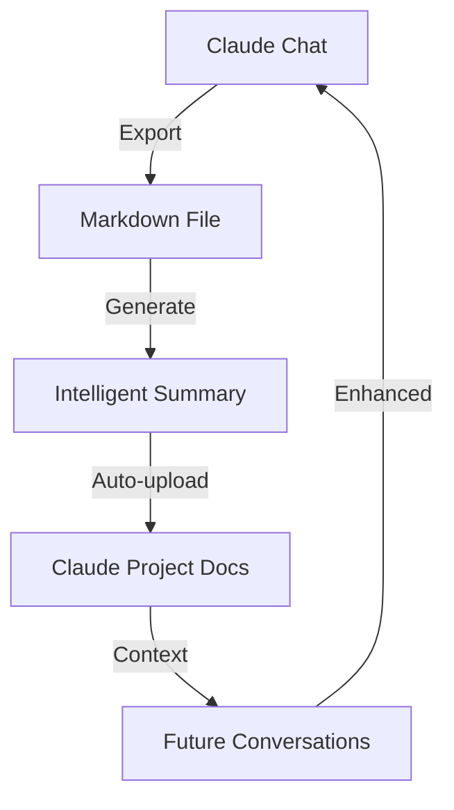

# 🤖 Claude Conversation Summarizer

Ever had a great conversation with Claude that you wished you could remember later? Or struggled to maintain context across multiple chat sessions? This tool solves those problems by intelligently exporting and summarizing your Claude conversations into beautiful markdown files.

## 🎯 Why This Matters

- **Project Continuity**: Keep track of important decisions, code snippets, and discussions across multiple Claude sessions
- **Knowledge Preservation**: Never lose valuable insights from your conversations
- **Context Maintenance**: Help Claude understand previous discussions when starting new conversations
- **Documentation**: Automatically create project documentation from your conversations
- **Coming Soon**: Auto-upload to Claude's project docs for persistent memory across all project conversations! 🚀

A TypeScript script that exports Claude conversations to markdown with intelligent summaries. Perfect for saving and organizing your Claude chats! 🎯

## 🔄 How It Works



### Context Maintenance Example
```typescript
// Previous conversation summary
const previousContext = {
  topics: ['React', 'Components', 'State Management'],
  decisions: ['Use Redux for state', 'Implement TypeScript'],
  codeExamples: ['Component structure', 'Redux setup']
};

// New conversation starts with context
const newConversation = {
  context: previousContext,
  messages: [
    {
      role: 'user',
      content: 'How do we implement the next feature?'
    }
  ]
};
```

## 🚀 Upcoming Features

### Auto-upload to Project Docs
- **Seamless Integration**: Automatically syncs with Claude's project documentation
- **Smart Organization**: Groups conversations by project and topic
- **Context Preservation**: Maintains conversation history for future reference
- **Real-time Updates**: Instant updates as new conversations are exported
- **Search & Filter**: Easy access to past discussions and decisions

#### Technical Implementation
```typescript
interface ProjectDoc {
  id: string;
  projectId: string;
  title: string;
  content: string;
  metadata: {
    type: 'conversation' | 'summary' | 'decision';
    date: string;
    topics: string[];
    tags: string[];
  };
  context: {
    previousConversations: string[];
    relatedDecisions: string[];
    codeExamples: string[];
  };
}

// Auto-upload configuration
interface UploadConfig {
  projectId: string;
  apiKey: string;
  endpoint: string;
  autoSync: boolean;
  organization: {
    byDate: boolean;
    byTopic: boolean;
    byProject: boolean;
  };
}
```

### Example Project Structure
```
project-docs/
├── conversations/
│   ├── 2024-03/
│   │   ├── architecture-decisions.md
│   │   └── feature-implementation.md
│   └── summaries/
│       └── project-overview.md
└── context/
    ├── decisions.json
    └── topics.json
```

## 🎥 Live Demo

[](https://github.com/TarekAloch/claude-summarizer/issues/1)

Try it out with our sample conversation! Click the badge above to see a live demo in the Issues tab.

## 🎬 Watch It In Action

[](https://raw.githubusercontent.com/TarekAloch/claude-summarizer/master/docs/gifs/claude-summarizer-demo.gif)
*Watch how easy it is to export and summarize your Claude conversations!*

### What's happening in the demo:
1. 📝 Creating a sample conversation
2. 🚀 Running the export script
3. 📊 Generating the summary
4. 💾 Saving the markdown file
5. 📱 Viewing the result

## 📸 Screenshots

### Conversation Export
[](https://raw.githubusercontent.com/TarekAloch/claude-summarizer/master/docs/images/conversation-export.png)
*Exported conversation with summary and formatted messages*

### Code Block Preservation
[](https://raw.githubusercontent.com/TarekAloch/claude-summarizer/master/docs/images/code-block.png)
*Code blocks are perfectly preserved with syntax highlighting*

### Summary Generation
[](https://raw.githubusercontent.com/TarekAloch/claude-summarizer/master/docs/images/summary.png)
*Intelligent summary with topics and statistics*

## ✨ Features

- 📝 Exports conversations to markdown format
- 🔍 Generates intelligent summaries including:
  - 🏷️ Main topics discussed
  - 💻 Number of code examples
  - 📊 Total message count
  - 📏 Total conversation length
- ⏰ Preserves timestamps and metadata
- 🎨 Maintains code block formatting
- 🔒 Secure and private - all processing happens locally

## 🚀 Installation

1. Clone this repository:
   ```bash
   git clone https://github.com/TarekAloch/claude-summarizer.git
   cd claude-summarizer
   ```

2. Install dependencies:
   ```bash
   npm install
   ```

## 💡 Usage

1. Create a conversation object following the `Conversation` interface:
   ```typescript
   const conversation: Conversation = {
     messages: [
       {
         role: 'user',
         content: 'Your message here',
         timestamp: '2024-03-31 10:00 AM'
       },
       {
         role: 'assistant',
         content: 'Claude\'s response here',
         timestamp: '2024-03-31 10:01 AM'
       }
     ],
     metadata: {
       title: 'Optional conversation title',
       date: '2024-03-31',
       model: 'Claude 3.5 Sonnet'
     }
   };
   ```

2. Run the script:
   ```bash
   npm start
   ```

The script will create a markdown file in the `conversations` directory with a timestamp in the filename. 📁

## 📋 Output Format

The generated markdown file will include:

1. 📌 Title and metadata
2. 📊 Summary section with:
   - 🏷️ Main topics discussed
   - 💻 Number of code examples
   - 📝 Total message count
   - 📏 Total conversation length
3. 💬 Full conversation with:
   - 👤 Messages formatted with role and timestamp
   - 💻 Preserved code blocks
   - 🎨 Proper markdown formatting

## 🌟 Example Output

```markdown
# Claude Conversation Export

**Date**: 2024-03-31
**Title**: React Component Creation
**Model**: Claude 3.5 Sonnet

## Summary

- **Topics**: component, function, return, world, hello
- **Code Examples**: 1 code blocks
- **Total Messages**: 2
- **Total Length**: 150 characters

## Conversation

### User (2024-03-31 10:00 AM)

How do I create a React component?

### Claude (2024-03-31 10:01 AM)

Here's how to create a basic React component:

```jsx
function MyComponent() {
  return <div>Hello World!</div>;
}
```
```

## 🔗 Helpful Links

### About Claude
- [Claude Documentation](https://docs.anthropic.com/claude/docs) 📚
- [Claude 3.5 Sonnet Release Notes](https://www.anthropic.com/news/claude-3-sonnet-20240229) 🆕
- [Claude API Reference](https://docs.anthropic.com/claude/reference/getting-started-with-the-api) 🔌

### About MCP (Model Context Protocol)
- [MCP GitHub Repository](https://github.com/modelcontextprotocol/servers) 🏗️
- [MCP Documentation](https://github.com/modelcontextprotocol/servers/wiki) 📖
- [MCP Examples](https://github.com/modelcontextprotocol/servers/tree/main/examples) 💡

### Related Tools
- [Cursor IDE](https://cursor.sh) - The best IDE for Claude integration 🖥️
- [GitHub Copilot](https://github.com/features/copilot) - Another great AI coding assistant 🤖
- [VS Code Claude Extension](https://marketplace.visualstudio.com/items?itemName=Anthropic.claude) - Use Claude in VS Code 🔌

## 🤝 Contributing

Contributions are welcome! Please feel free to submit a Pull Request. For major changes, please open an issue first to discuss what you would like to change.

## 📄 License

This project is licensed under the MIT License - see the [LICENSE](LICENSE) file for details.

## 🙏 Acknowledgments

- Thanks to Anthropic for creating Claude! 🤖
- Thanks to the MCP team for their amazing protocol! 🏗️
- Thanks to all contributors who help improve this tool! 👥 

## 📝 Note

The screenshots above are placeholders. To add real screenshots:
1. Take a screenshot of your exported conversation
2. Save it in the `docs/images` directory
3. Update the image paths in this README
4. Submit a pull request with your screenshots 

## 💡 Best Practices

### 1. Conversation Organization
- 📁 Create separate folders for different projects
- 📅 Use consistent naming conventions with dates
- 🏷️ Tag conversations with relevant topics
- 📝 Add descriptive titles for easy reference

### 2. Context Management
- 🔄 Export conversations regularly
- 📊 Keep summaries up to date
- 🔗 Link related conversations
- 📌 Pin important decisions

### 3. Code Examples
- 💻 Use consistent code block formatting
- 🎨 Include language-specific syntax highlighting
- 📝 Add comments for complex code
- 🔍 Include context around code snippets

### 4. Documentation
- 📚 Maintain a project overview
- 📋 Document key decisions
- 🔍 Include searchable metadata
- 📊 Track project progress

### 5. Security
- 🔒 Keep sensitive information out of exports
- 🔑 Use environment variables for API keys
- 📁 Set appropriate file permissions
- 🔐 Encrypt sensitive data if needed 